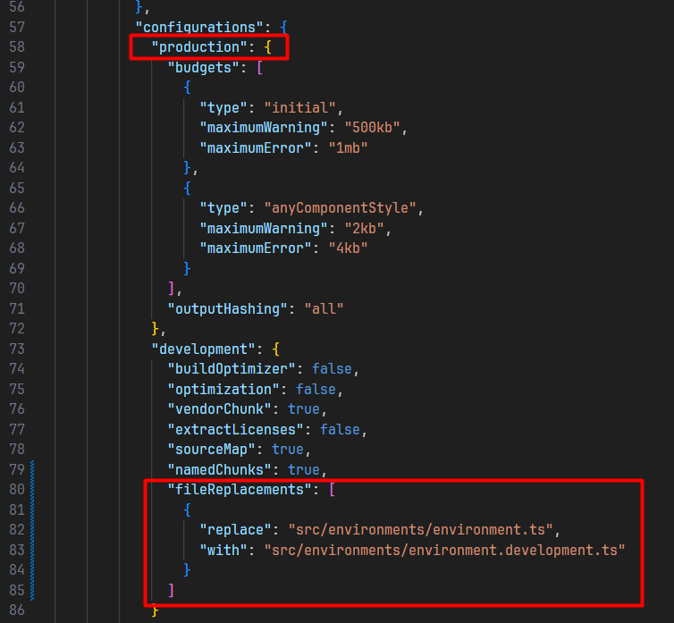
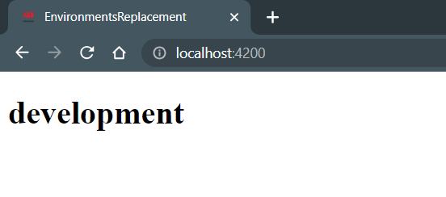
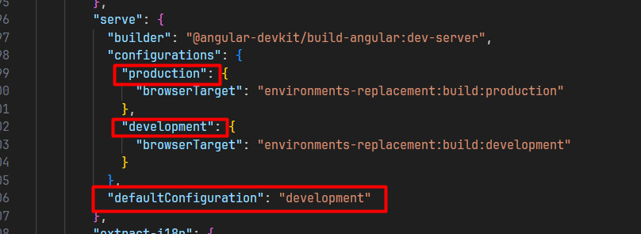
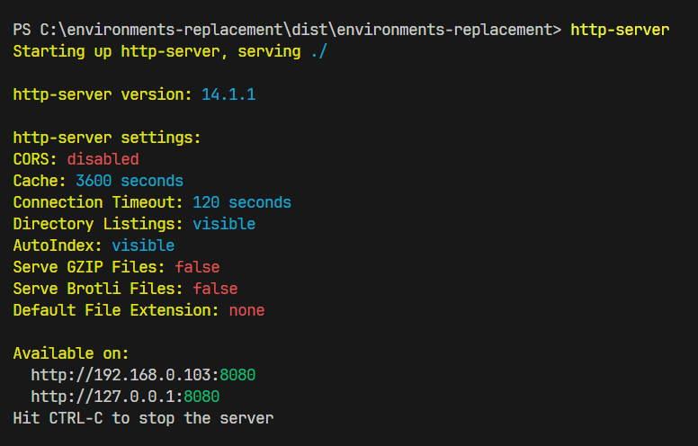
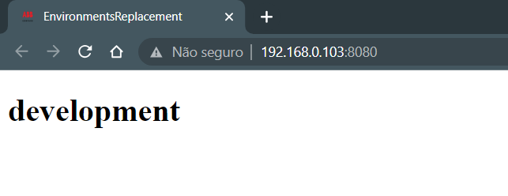
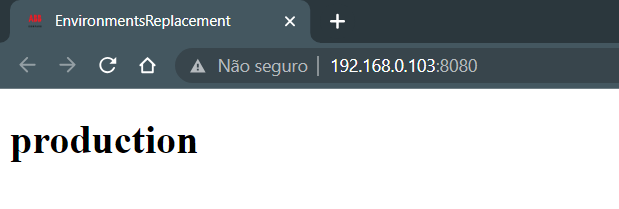

### AO GERAR UM NOVO PROEJTO

```angular2html
ng new meu-projeto --style=sass
ng new meu-projeto --style=less
ng new meu-projeto --style=stylus
```

### EM UM PROJETO EXISTENTE

#### Version old
```angular2html
ng set defaults.styleExt scss
ng set defaults.styleExt less
ng set defaults.styleExt styl
```
#### new version ("css", "scss", "sass", "less", "none")
```angular2html
ng config schematics.@schematics/angular:component.style scss
ng config schematics.@schematics/angular:component.style sass
ng config schematics.@schematics/angular:component.style less

```

COAMNDOS ANGULAR CLI DE VERIFICAÇÃO E TESTE
- ng lint: ng lint é usado para análise estática e conformidade com padrões de codificação.
- ng test: ng test é usado para executar testes de unidade em partes específicas do seu código.
- ng e2e: ng e2e é usado para realizar testes end-to-end (teste de integração) para verificar o comportamento geral do seu aplicativo


### Dependencies x DevDependencies (package.json)

- dependencies: dependências necessárias para executar a aplicação
- DevDependencies: dependências necessárias paera 
desenvolver a aplicação (não necessárias após o
build de produção)

### Comandos para geração do build de desenvolvimento
```angular2html
ng build --target=development --environment=dev
ng build --dev --e=dev
ng build --dev
ng build
```

### Comandos para geração do build de produção

##### Versões antigas
```angular2html
ng build --target=production --environment=prod
ng build --prod --env=prod
ng build --prod
```
- Os arquivos são gerados dentro de /dist
- tutorial atualizado: https://pt.linkedin.com/pulse/angular-16-environments-ng-build-lucas-favareto-santos

##### Novas versões

- 1° Devemos criar a pasta de src/environments.
```
ng generate environments
```

Veja o que foi adicionado no angular.json:



É aí que está a “mágica”, quando gerarmos o build da aplicação no modo development os arquivos serão substituídos, sai o de produção e entra o de desenvolvimento
Para ver as coisas na prática vamos colocar algo nos arquivos environments:

environment.development.ts:

```typescript
export const environment = {
    mode: 'development'
};
```

environment.ts

```typescript
export const environment = {
  mode: 'production'
};
```
Agora em app.component.ts vamos ter o seguinte:

```typescript
import { Component } from '@angular/core'; 
import { environment } from 'src/environments/environment.development'; 

@Component({
  selector: 'app-root',
  templateUrl: './app.component.html',
  styleUrls: ['./app.component.css']
}) 
export class AppComponent {
  public mode: string = environment.mode;
}
```

E no app.component.html:
```html
<h1>{{ mode }}</h1>

```
Executando o comando ng serve teremos a aplicação em modo de development como esperado:


Como esperado, no ambiente de desenvolvimento temos o uso do arquivo enviroment.development.ts, e isso acontece pois no arquivo angular.json existe a seguinte configuração:



Para gerar o build de produção vamos executar o comando ng build e com isso será gerada a pasta dist que é a usada para colocar em um servidor, mas para facilitar nossa vida vamos usar a biblioteca http-server que cria um servidor local para testes, para instalar basta executar o comando npm install http-server, com a biblioteca instalar basta entrar na pasta dist/nome do projeto e executar o comando http-server


Como resultado temos algo decepcionante:


Para gerar o build de produção devemos passar mais um parâmetro na hora do build que é o configuration=production, então o comando fica da seguinte forma: ng build --configuration=production

E no nosso arquivo package.json podemos registrar esse script com um atalho
```json 
"build:dev": "ng build", 
"build:prod": "ng build --configuration=production",
```
E para rodar o comando basta colocar o npm run na frente, ficando assim:

```angularjs
npm run build:prod
```
Para ver se deu tudo certo é preciso repetir o processo de executar o comando http-server dentro de dist/nome do projeto e limpar o cache do navegador se for preciso, no meu caso deu tudo certo:

